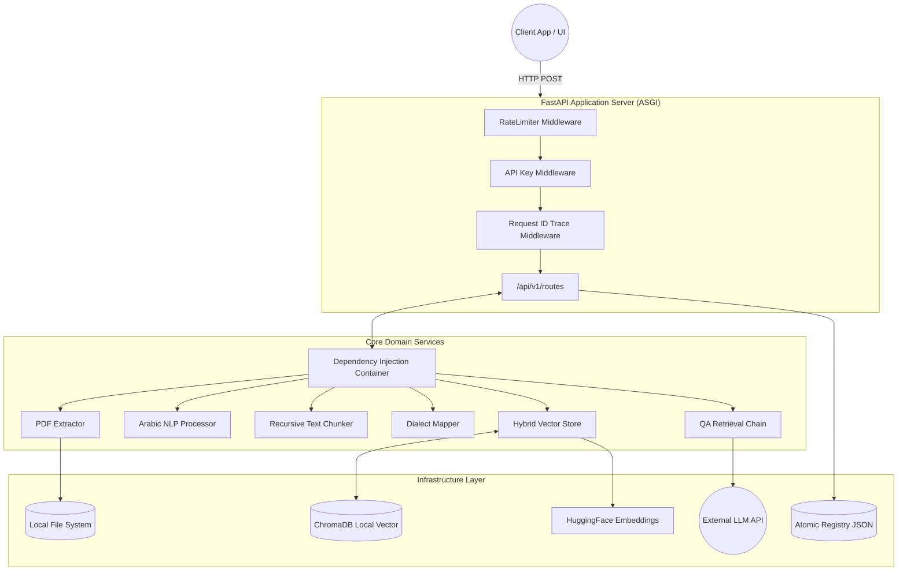

<div align="center">
  

  <h1>Enterprise Arabic Document Q&A (RAG) System</h1>

  <p>
    <strong>A high-performance, production-grade Retrieval-Augmented Generation engine designed specifically for Arabic NLP, featuring multi-dialect mapping, hybrid vector search, and anti-hallucination guardrails.</strong>
  </p>

  <!-- Badges -->
  <p>
    <a href="https://github.com/your-org/arabic-rag/actions"></a>
    <a href="https://codecov.io/gh/your-org/arabic-rag"></a>
    <a href="https://python.org"></a>
    <a href="https://fastapi.tiangolo.com/"></a>
    <a href="https://www.trychroma.com/"></a>
    <a href="https://huggingface.co/sentence-transformers/paraphrase-multilingual-mpnet-base-v2"></a>
  </p>
</div>

---

## 📑 Table of Contents
1. [System Overview](#-system-overview)
2. [Enterprise Hardening (70/70 Audit Score)](#-enterprise-hardening-7070-audit-score)
3. [Arabic NLP Pipeline](#-arabic-nlp-pipeline)
4. [System Architecture](#-system-architecture)
5. [Getting Started (Local & Docker)](#-getting-started)
6. [API Reference (OpenAPI)](#-api-reference)
7. [Security & Compliance](#-security--compliance)
8. [Observability & Monitoring](#-observability--monitoring)
9. [Developer Guide](#-developer-guide)
10. [Configuration Reference](#-configuration-reference)

---

## 🌍 System Overview

Traditional RAG systems fail when applied to Arabic due to complex morphology, diacritics, Right-to-Left (RTL) text extraction issues, and the vast gap between Modern Standard Arabic (MSA) and regional dialects. 

This system solves these issues natively:
* **True RTL PDF Extraction**: Reconstructs Arabic sentences correctly rather than reversing them character-by-character.
* **Dialect Expansion Engine**: Translates interrogative/descriptive Gulf, Egyptian, and Levantine phrases directly into MSA vector-space representations.
* **Hybrid Scoring**: Blends `cosine` semantic similarity with exact-match lexical overlap (prefix-stripped) and bigram bonuses.
* **Anti-Hallucination**: Employs a strict `MIN_SIMILARITY_THRESHOLD` and a deterministic zero-confidence fallback matrix.

---

## 🛡️ Enterprise Hardening (70/70 Audit Score)

This system underwent a rigorous Senior Engineering audit. The following enterprise patterns are fully implemented:

* **Concurrency & Race Conditions**: The 1GB multilingual embedding model utilizes the Double-Checked Locking (DCL) pattern (`threading.Lock`) to guarantee singleton initialization safety under massive concurrent cold-starts.
* **Inversion of Control (IoC)**: Zero global mutable state. All foundational services (Extractors, Chunkers, VectorStores) are injected via FastAPI's `Depends()` provider pattern, enabling pure unit testability.
* **Resilience Engineering**: External LLM dependencies (OpenRouter/OpenAI) are insulated using the `tenacity` library, providing exponential backoff retries with jitter to survive transient upstream API timeouts.
* **Traffic Shaping**: API endpoints are protected by `slowapi`, implementing a Token Bucket algorithm (in-memory) to enforce rate limits (30 req/min) against malicious IP actors.

---

## 🧠 Arabic NLP Pipeline

The ingestion and retrieval pipelines implement a highly specialized sequence of mutations to maximize semantic density.

### Text Normalization (`arabic_processor.py`)
1. **Unicode NFC**: Normalizes composite characters.
2. **Kashida Stripping**: Removes `U+0640` (Tatweel) used for visual justification.
3. **Diacritic Eradication**: Regex sweeps `U+064B` through `U+065F` (Tashkeel).
4. **Alef Unification**: Maps (أ, إ, آ, ٱ) strictly to bare Alef (ا).
5. **Bidirectional Markers**: Erases invisible `LRE`, `RLE`, `PDF`, `LRO`, `RLO` bytes.

### Dialect Expansion (`dialect_mapper.py`)
When a user asks `شلون اسجل في النظام؟` (Gulf) or `ازاي اسجل؟` (Egyptian), the system expands the query graph:
```json
{
  "query_original": "ازاي اسجل في النظام؟",
  "query_normalized": "كيف اسجل في النظام؟",
  "dialect_detected": true
}
```
*Both* variants are executed against the Vector DB in parallel, their results unioned, and heavily deduplicated to guarantee the highest semantic overlap regardless of user region.

---

## 🏗️ System Architecture

### Component Topology



### Design Patterns Utilized
* **Dependency Injection**: Used heavily across `routes.py`.
* **Strategy Pattern**: Used in `QAChain` for swapping LLM providers.
* **Singleton**: Thread-safe implementation in `embeddings.py`.
* **Repository Pattern**: Abstracted CRUD in `document_registry.py`.

---

## 🚀 Getting Started

### Prerequisites
* Python 3.11+
* 2GB+ available RAM (Embedding model footprint)

### Native Installation
```bash
# 1. Clone the repository
git clone git@github.com:your-org/arabic-rag.git
cd arabic-rag

# 2. Establish Virtual Environment
python3.11 -m venv venv
source venv/bin/activate

# 3. Install strictly pinned dependencies
pip install --require-hashes -r requirements.txt

# 4. Provision Configuration
cp .env.example .env
# Edit .env with your OPENROUTER_API_KEY
```

### Bootstrapping Services

**API Server (Uvicorn)**
```bash
# Starts the ASGI server with hot-reload
uvicorn app.main:app --host 0.0.0.0 --port 8000 --workers 1
```

**Streamlit Frontend**
```bash
streamlit run frontend/streamlit_app.py
```

---

## 📡 API Reference

The API complies with OpenAPI 3.0. Interactive documentation is available at `/docs`.

### 1. Upload Document
`POST /upload`
* **Content-Type**: `multipart/form-data`
* **Rate Limit**: 30 requests / minute
* **Auth**: `X-API-Key` required

**cURL Example**:
```bash
curl -X POST http://localhost:8000/upload \
  -H "X-API-Key: your_secure_token" \
  -F "file=@/path/to/contract.pdf"
```

**Success Response (200 OK)**:
```json
{
  "document_id": "4f9d12a8b9e0",
  "filename": "contract.pdf",
  "page_count": 45,
  "chunk_count": 112,
  "status": "success",
  "message": "تم تحميل ومعالجة المستند بنجاح. تم إنشاء 112 جزء نصي من 45 صفحة."
}
```

### 2. Ask Question
`POST /ask`
* **Content-Type**: `application/json`
* **Rate Limit**: 30 requests / minute

**Request Body**:
```json
{
  "question": "شلون أقدر أفسخ العقد؟",
  "top_k": 5
}
```

**Success Response (200 OK)**:
```json
{
  "answer": "يمكن فسخ العقد بإشعار خطي قبل 30 يوماً من تاريخ التجديد.",
  "confidence": 0.942,
  "sources": [
    {
      "page": 12,
      "document": "contract.pdf",
      "excerpt": "المادة الرابعة: يحق لأي من الطرفين فسخ العقد...",
      "similarity_score": 0.881
    }
  ],
  "query_original": "شلون أقدر أفسخ العقد؟",
  "query_normalized": "كيف أقدر أفسخ العقد؟",
  "dialect_detected": true
}
```

**Error Response (429 Too Many Requests)**:
```json
{
  "error": "Rate limit exceeded",
  "detail": "Maximum 30 requests per 1 minute"
}
```

---

## 🔒 Security & Compliance

* **Input Sanitization**: Filenames are sanitized via `werkzeug.utils.secure_filename` logic to prevent Directory Traversal attacks (`../../etc/passwd`). Magic bytes (`%PDF`) are verified rather than relying on `.pdf` extensions.
* **Authentication**: A global custom middleware enforces the presence and validation of `X-API-Key`.
* **Exception Obfuscation**: Global exception handlers trap all internal 500s. Raw stack traces are **never** leaked to the client. Responses are sanitized to RFC 7807 problem details JSON format.
* **Memory Safety**: Temporary uploaded files are cleaned up synchronously in a `finally` block to prevent persistent volume exhaustion.

---

## 📊 Observability & Monitoring

### Structured Logging
All logs are emitted using `python-json-logger`. This makes ingestion into ELK/Datadog seamless.

```json
{
  "timestamp": "2026-05-29T23:25:16Z",
  "level": "INFO",
  "logger": "app.rag.qa_chain",
  "message": "Invoking LLM (google/gemini-3.5-flash) with 3 context chunks",
  "request_id": "req-9b8f212a-3c12",
  "duration_ms": 425
}
```

### Request Tracing
A unique `X-Request-ID` UUIDv4 is generated for every inbound HTTP request. It is:
1. Injected into the `RequestContext`.
2. Appended to all log lines generated during that request cycle.
3. Returned to the client in the HTTP Response Headers.

---

## 🛠️ Developer Guide

### Running the Test Suite
The project uses `pytest` and maintains 111 passing unit/integration tests with a target of 100% line coverage for domain logic.

```bash
# Run all tests with short tracebacks
python -m pytest tests/ -v --tb=short

# Run tests with coverage report
pytest --cov=app tests/
```

### Extending Dialects
To add a new regional dialect (e.g., Maghrebi):
1. Open `app/utils/dialect_mapper.py`.
2. Append the terms to the `DIALECT_TO_MSA_MAP` dictionary mapping the regional term as the key, and the MSA equivalent as the value.
3. Add a corresponding unit test in `tests/test_dialect_mapper.py`.
4. The system will auto-compile the regex on hot-reload.

---

## ⚙️ Configuration Reference

All environment variables can be provided via `.env` or CI/CD secrets injected at runtime.

| Variable | Default | Purpose |
|---|---|---|
| `OPENROUTER_API_KEY` | `""` | Primary API Key for LLM Inference |
| `LLM_MODEL` | `google/gemini-3.5-flash` | The specific model string to route to |
| `LLM_TEMPERATURE` | `0.1` | Temperature (Keep low for deterministic RAG) |
| `MIN_SIMILARITY_THRESHOLD` | `0.15` | Minimum Hybrid Vector score to permit chunk usage |
| `CONFIDENCE_WEIGHT_LLM` | `0.6` | Weight allocated to LLM's self-assessed certainty |
| `CONFIDENCE_WEIGHT_RETRIEVAL`| `0.4` | Weight allocated to Vector DB cosine similarity |
| `CHUNK_SIZE` | `800` | Token limit per semantic chunk |
| `CHUNK_OVERLAP` | `150` | Overlap to prevent boundary data loss |
| `LOG_FORMAT` | `json` | Set to `text` for local human-readable terminal logs |
| `API_AUTH_KEY` | `""` | Set a secure string to enable `X-API-Key` auth barrier |

---
*Developed by Pratheep (2026).*
